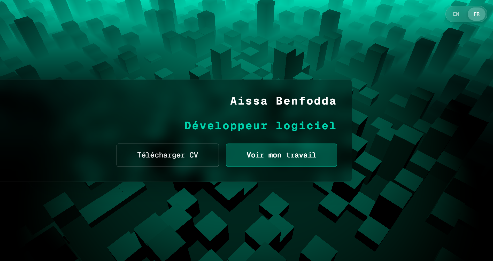

# ✨ Portfolio - Interactive 3D Experience

> A modern, multilingual portfolio website featuring an immersive 3D environment powered by Three.js and SvelteKit.



## 🎯 Overview

This portfolio showcases a unique blend of creativity and technical expertise through an interactive 3D scene. Built with performance and user experience in mind, it features dynamic cube animations, intelligent lighting effects, and smooth transitions - all while maintaining excellent performance.

## �️ Tech Stack

- **Framework:** [SvelteKit](https://kit.svelte.dev/) - Modern web framework with TypeScript
- **3D Graphics:** [Three.js](https://threejs.org/) - WebGL-powered 3D rendering
- **Styling:** [Tailwind CSS](https://tailwindcss.com/) - Utility-first CSS framework
- **Package Manager:** [pnpm](https://pnpm.io/) - Fast, disk space efficient package manager
- **Build Tool:** [Vite](https://vitejs.dev/) - Next generation frontend tooling
- **Database:** [Supabase](https://supabase.com/) - PostgreSQL database for analytics
- **Deployment:** [Vercel](https://vercel.com/) - Serverless deployment platform

## 🚀 Features

### 🌍 Internationalization
- **Multi-language Support** - Currently supporting English and French
- **Language Switcher** - Easy language selection with persistent preferences

### 📊 Analytics & Admin
- **Built-in Analytics** - Track visitor interactions and page views with Supabase
- **Admin Dashboard** - Protected admin panel for viewing statistics
- **Secret Access** - Type `ADMIN` anywhere on the site to access the admin panel
- **Performance Monitoring** - Optional FPS counter for development
- **Privacy Controls** - Toggle tracking on/off via environment variables

### ⚡ Performance
- **Optimized 3D Rendering** - Efficient cube spawning with configurable probability
- **Sin Lookup Table** - Pre-computed trigonometric values for smooth animations
- **Resource Preloading** - Smart asset loading for faster initial render

## 📦 Installation

### Prerequisites
- Node.js 18+ 
- pnpm (recommended) or npm

## ⚙️ Configuration

### Environment Variables (Vercel Only)

All configuration is managed through **Vercel Environment Variables**. No local `.env` files are needed.

#### Required Variables

Set these in your Vercel project settings (Project Settings → Environment Variables):

**Database & Analytics:**
```env
SUPABASE_URL=https://xxx.supabase.co        # Your Supabase project URL
SUPABASE_ANON_KEY=your_anon_key             # Your Supabase anonymous key
PUBLIC_SHOULD_TRACK=true                     # Enable/disable analytics tracking
```

**Admin Access:**
```env
ADMIN_PASSWORD=your_secure_password          # Admin dashboard password
```

**Optional:**
```env
VITE_SHOW_FPS=false                          # Show FPS counter (set true for debugging)
VITE_VERSION=1.0.0                           # Application version
```

### Supabase Setup

1. **Create a Supabase Project** at [supabase.com](https://supabase.com)

2. **Run this SQL** in your Supabase SQL Editor:

```sql
CREATE TABLE analytics_events (
  id BIGSERIAL PRIMARY KEY,
  event_type TEXT NOT NULL,
  session_id TEXT,
  timestamp TIMESTAMPTZ DEFAULT NOW(),
  button TEXT,
  language TEXT,
  duration INTEGER,
  is_maybe_a_bot BOOLEAN
);

-- Index for faster time-based queries
CREATE INDEX idx_analytics_timestamp ON analytics_events(timestamp);

-- Enable Row Level Security
ALTER TABLE analytics_events ENABLE ROW LEVEL SECURITY;

-- Allow anonymous inserts (for tracking)
CREATE POLICY "Allow anonymous inserts" ON analytics_events
  FOR INSERT
  WITH CHECK (true);

-- Allow authenticated reads (for admin)
CREATE POLICY "Allow authenticated reads" ON analytics_events
  FOR SELECT
  USING (true);
```

3. **Get your credentials** from Settings → API:
   - Copy `Project URL` → Set as `SUPABASE_URL`
   - Copy `anon/public` key → Set as `SUPABASE_ANON_KEY`

4. **Regenerate TypeScript types** (optional, when schema changes):
```bash
npx supabase gen types typescript --project-id YOUR_PROJECT_ID --schema public > src/lib/database.types.ts
```

### Scene Settings

Customize the 3D experience in [src/lib/settings.ts](src/lib/settings.ts):

```typescript
{
  showFPS: false,                    // Display performance metrics
  isFogEnabled: true,                 // Atmospheric fog effect
  scrollbarAlwaysOn: true,            // Scrollbar visibility
  cubeSize: 1.5,                      // Size of 3D cubes
  floorSize: 100,                     // Grid dimensions
  maxCubeHeight: 5,                   // Maximum cube animation height
  cubeSpawnProbability: 0.35,         // Density of cube field (0-1)
  rotationSpeed: {
    normal: 0.001,                    // Default camera rotation
    fast: 0.005                       // Accelerated rotation
  },
  mouseLight: {
    color: 0x00ffd1,                  // Cyan spotlight color
    intensity: 10,
    distance: 50,
    height: 10
  }
}
```

## 🎨 Customization

### Adding New Languages

1. Create translation file in `src/lib/translations/{lang}.ts`
2. Export translations object with all required keys
3. Update language selector component
4. Add route in `src/routes/[lang]/`

## 🚀 Deployment

### Deploy to Vercel

1. **Push to GitHub** (or GitLab/Bitbucket)
```bash
git add .
git commit -m "Ready for deployment"
git push
```

2. **Import to Vercel**
   - Go to [vercel.com](https://vercel.com)
   - Click "Import Project"
   - Select your repository
   - Vercel auto-detects SvelteKit

3. **Set Environment Variables**
   - Go to Project Settings → Environment Variables
   - Add all required variables (see Configuration section above)
   - Make sure to set them for **Production** environment

4. **Deploy**
   - Click "Deploy"
   - Or use CLI: `vercel --prod`

### Local Production Testing

```bash
# Create optimized build
pnpm build

# Test production build locally
pnpm preview
```

### Important Notes

- All environment variables are managed in Vercel dashboard
- Set `PUBLIC_SHOULD_TRACK=false` to disable analytics
- Use a strong `ADMIN_PASSWORD` in production
- For local development, use `vercel env pull` to download environment variables
- Database types can be regenerated with `npx supabase gen types`

## 📈 Performance Tips

- Adjust `cubeSpawnProbability` for lower-end devices
- Disable fog with `isFogEnabled: false` if needed
- Modify `rotationSpeed` for smoother animations
- Use `showFPS` to monitor performance during development

## 🤝 Contributing

This is a personal portfolio project, but suggestions and feedback are welcome!

## 📄 License

This project is open source and available under the [MIT License](LICENSE).

---

**Built with ❤️ using SvelteKit and Three.js**
